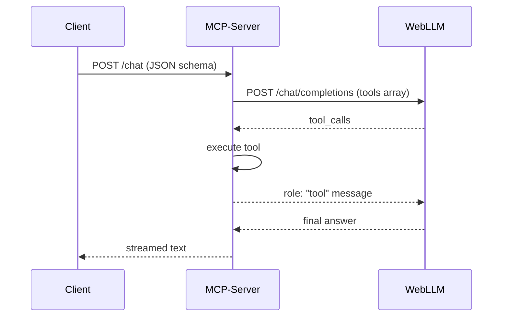

WebLLM doesn’t speak **MCP (Model Context Protocol)** out-of-the-box, but because its chat-completions API already supports OpenAI-style *function calling*, it can sit behind an MCP client or server with only a thin adapter layer. In other words, yes—you can use WebLLM inside an MCP tool chain, but you have to provide the “glue” that translates MCP messages to WebLLM’s `tools` / `tool_calls` fields and back again.([GitHub][1], [Anthropic][2], [Neon][3])

---

## MCP versus plain function calling

|                | Function calling (OpenAI spec)                          | Model Context Protocol (MCP)                                                            |
| -------------- | ------------------------------------------------------- | --------------------------------------------------------------------------------------- |
| **Scope**      | One-shot invocation of a JSON-schema-described function | Stateful, two-way channel between *any* LLM client and a *server* that hosts many tools |
| **Transport**  | Piggy-backs on the `chat/completions` request/response  | Separate HTTP endpoints (`/chat`, `/tools/list`, `/tools/call`, …)                      |
| **Memory**     | Call context is implicit in the message array           | Protocol guarantees a unique *conversation-id* and lets server stream updates           |
| **LLM burden** | Model must emit a single `tool_call` block              | Client library handles schema lookup; LLM can ignore plumbing                           |

Function calling is a *subset* of MCP’s capabilities; MCP adds discovery, long-lived sessions and evented callbacks.([Neon][3], [DEV Community][4], [Reddit][5], [openai.github.io][6])

---

## Where WebLLM stands today

* **Function calling status:** marked *WIP* but already usable with the two Hermes-2-Pro checkpoints; only one tool call per assistant message.([GitHub][1], [GitHub][7])
* **No native MCP handshake:** the repo, examples and NPM package expose only the OpenAI-compatible REST surface.([GitHub][1])
* **Local-first deployment:** because inference happens entirely in the browser (or Node/Service-Worker), you are free to add a tiny MCP shim in front of it—no external GPU server required. Practitioners have demoed exactly this with other local LLMs.([Medium][8], [Medium][9])
* **Community demand:** threads and blog posts already show people wrapping local models with MCP so they can plug into Claude Desktop, Cursor, etc.—WebLLM can be treated the same way.([Reddit][10], [Medium][11])

---

## Two common integration patterns

### 1. **Browser-only bridge** (all local)

1. Load WebLLM (Hermes-2-Pro) in your page.
2. In the same page, instantiate an **MCP client** (e.g. `@anthropic-ai/mcp-js` or any fetch-based client).
3. On every `chat` turn:

   * Convert the MCP tool list into WebLLM’s `tools` array.
   * Call `engine.chat.completions.create({ messages, tools })`.
   * When WebLLM returns `tool_calls`, immediately invoke `client.tools.call()` against the MCP server.
   * Push a `tool`-role message back into WebLLM and continue.

Because both sides run in the browser, no CORS headaches—just fetch.([Anthropic][2], [modelcontextprotocol.io][12])

### 2. **Local MCP server proxy** (Node)

1. Spin up the reference **Python MCP server** from Anthropic or OpenAI Agents SDK.([openai.github.io][6])
2. Mount WebLLM behind an endpoint, e.g. `/chat`. Your proxy translates:



3. Register your own **tool adapters** (`sqlite.query`, `browser.openTab`, etc.) on the server side—WebLLM never sees raw sockets or databases.([philschmid.de][13], [playbooks.com][14])

---

## Minimal TypeScript sketch

```ts
import { CreateMLCEngine } from "@mlc-ai/web-llm";
import { MCPClient } from "@anthropic-ai/mcp-js";

const engine = await CreateMLCEngine("Hermes-2-Pro-Llama-3-8B-q4f32_1-MLC");
const mcp   = new MCPClient("http://localhost:7090");   // your MCP server

async function chatMCP(messages) {
  // 1. fetch tool list once per session
  const mcpTools = await mcp.listTools();
  const tools = mcpTools.map(toJSONSchemaForWebLLM);

  // 2. delegate to WebLLM
  const rsp = await engine.chat.completions.create({ messages, tools, tool_choice:"auto" });
  const call = rsp.choices[0].message.tool_calls?.[0];

  if (call) {
    const result = await mcp.callTool(call.function.name, JSON.parse(call.function.arguments));
    messages.push(rsp.choices[0].message);
    messages.push({ role:"tool", name:call.function.name, content:JSON.stringify(result) });
    return chatMCP(messages);        // recurse once – Hermes can only call one tool per turn
  }

  return rsp.choices[0].message.content;
}
```

*(Adapter helpers not shown; they convert MCP’s JSON-Schema into the `tools` array WebLLM expects.)*

---

## Caveats & best practices

* **One-tool limit:** Hermes-2-Pro will emit only one `tool_call` per assistant turn; if your MCP workflow chains tools, loop as in the snippet.([GitHub][7])
* **Context size:** MCP servers often inject many-kilobyte schemas; watch WebLLM’s 8 k-token limit in the browser.([GitHub][1], [Neon][3])
* **Security:** Treat arguments from the model as untrusted—sandbox side-effects just as you would with cloud LLMs.([DEV Community][4])
* **Performance:** WebGPU initialisation adds \~500 ms cold-start; cache models with Service-Workers if your MCP agent aims for snappy responses.([GitHub][1], [Medium][15])

---

### Bottom line

> **Yes, WebLLM can be the LLM behind any MCP workflow**—you simply bridge MCP’s HTTP messages to WebLLM’s OpenAI-compatible function-calling interface. The job is mostly plumbing code; once that’s in place you get a fully local, privacy-preserving MCP agent that runs entirely in the browser or on a low-power box.

[1]: https://github.com/mlc-ai/web-llm "GitHub - mlc-ai/web-llm: High-performance In-browser LLM Inference Engine"
[2]: https://docs.anthropic.com/en/docs/agents-and-tools/mcp "Model Context Protocol (MCP) - Anthropic"
[3]: https://neon.tech/blog/mcp-vs-llm-function-calling "What's MCP all about? Comparing MCP with LLM function calling - Neon"
[4]: https://dev.to/zachary62/model-context-protocol-mcp-simply-explained-function-calling-rebranded-or-genuine-breakthrough-4c04 "MCP Simply Explained: Function Calling Rebranded or Genuine Breakthrough? - DEV Community"
[5]: https://www.reddit.com/r/ClaudeAI/comments/1h0w1z6/model_context_protocol_vs_function_calling_whats/ "Model Context Protocol vs Function Calling: What's the Big Difference? : r/ClaudeAI"
[6]: https://openai.github.io/openai-agents-python/mcp/ "Model context protocol (MCP) - OpenAI Agents SDK"
[7]: https://github.com/mlc-ai/web-llm/issues/297 "♥️ Function Calling-only model · Issue #297 · mlc-ai/web-llm · GitHub"
[8]: https://medium.com/predict/using-the-model-context-protocol-mcp-with-a-local-llm-e398d6f318c3 "Using the Model Context Protocol (MCP) With a Local LLM | by Ashraff Hathibelagal | Predict | Medium"
[9]: https://medium.com/predict/using-the-model-context-protocol-mcp-with-a-local-llm-e398d6f318c3?utm_source=chatgpt.com "Using the Model Context Protocol (MCP) With a Local LLM - Medium"
[10]: https://www.reddit.com/r/LocalLLaMA/comments/1jvpko7/the_ultimate_mcp_client/?utm_source=chatgpt.com "The Ultimate MCP Client : r/LocalLLaMA - Reddit"
[11]: https://medium.com/%40jonigl/build-an-mcp-client-in-minutes-local-ai-agents-just-got-real-a10e186a560f?utm_source=chatgpt.com "Build an MCP Client in Minutes: Local AI Agents Just Got Real"
[12]: https://modelcontextprotocol.io/docs/concepts/tools?utm_source=chatgpt.com "Tools - Model Context Protocol"
[13]: https://www.philschmid.de/mcp-example-llama?utm_source=chatgpt.com "How to use Anthropic MCP Server with open LLMs, OpenAI or ..."
[14]: https://playbooks.com/mcp/jaho5-json-schema-manager?utm_source=chatgpt.com "JSON Schema Manager MCP server for AI agents - Playbooks"
[15]: https://medium.com/the-constellar-digital-technology-blog/geek-out-time-ai-in-the-browser-run-webllm-for-powerful-local-llm-experiences-f89f80c77e78 "Geek Out Time: AI in the Browser- Run WebLLM for Powerful, Local LLM Experiences | by Nedved Yang | The Constellar Digital&Technology Blog | Medium"
