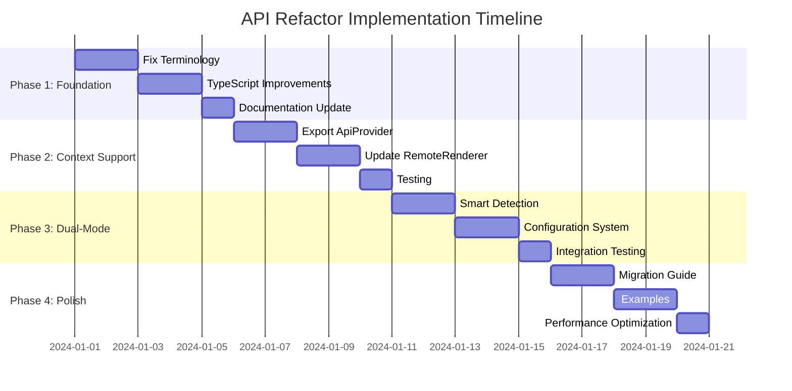

# API Refactor Plan: Dual-Pattern Support for Module Federation

## 🎯 Objective

Refactor the current API integration to support **both** the Bridge Pattern and React Context Pattern, allowing remotes to choose the most appropriate approach for their use case.

## 📊 Current State Analysis

### ✅ What Works Well
- **Bridge Pattern**: `window.__HOST_API_BRIDGE__` provides cross-remote communication
- **API Registration**: Components register successfully across federated boundaries
- **Handler System**: Event bus enables action handler registration
- **Testing Interface**: Global `__PROMETHEOS_API__` for browser console testing
- **Sophisticated Integration**: 7-layer architecture preserved

### ⚠️ Current Issues (historical) / ✅ Current Status
- (was) Misleading terminology around "fallback" → ✅ clarified in logs/messages
- (was) Single pattern (bridge-only) → ✅ dual-pattern implemented (React Context + Bridge)
- (was) Over-engineered for React remotes → ✅ React Context path available and preferred
- (was) Type safety weaker on bridge → ✅ typed Context path; bridge typings improved
- (was) DX non-idiomatic for React → ✅ idiomatic Context integration available

## 🏗️ Proposed Architecture: Dual-Pattern Support

### Pattern 1: Bridge Pattern (Current)
```javascript
// Remote uses global bridge directly
const apiClient = useApiClient(); // Uses window.__HOST_API_BRIDGE__
```

**Advantages:**
- ✅ Framework agnostic (works with non-React remotes)
- ✅ Explicit control and debugging
- ✅ Independence from host Context lifecycle
- ✅ Legacy compatibility

### Pattern 2: React Context Pattern (New)
```javascript
// Host wraps remote with Context
<ApiClientProvider>
  <RemoteComponent />
</ApiClientProvider>

// Remote uses normal React Context
const apiClient = useApiClient(); // Uses React Context
```

**Advantages:**
- ✅ Idiomatic React patterns
- ✅ Better TypeScript integration
- ✅ React DevTools support
- ✅ Cleaner, more maintainable code

## 📋 Implementation Plan

### Phase 1: Improve Bridge Pattern (Week 1) — ✅ Completed

#### 1.1 Fix Terminology and Logging
```typescript
// packages/shared-api-client/src/hooks.tsx
export function useApiClient(): IApiClient {
  const context = useContext(ApiClientContext);

  // Priority 1: React Context (preferred for React remotes)
  if (context) {
    console.log('[API Client] ✅ Using React Context Pattern');
    return context;
  }

  // Priority 2: Module Federation Host Bridge (for non-React or legacy remotes)
  if (typeof window !== 'undefined' && window.__HOST_API_BRIDGE__) {
    console.log('[API Client] ✅ Using Module Federation Bridge Pattern');
    return getApiClient();
  }

  throw new Error('useApiClient requires ApiClientProvider or Module Federation Host Bridge');
}
```

#### 1.2 Enhance Bridge Documentation
- Add clear JSDoc comments explaining when to use bridge pattern
- Update console messages to be more descriptive
- Create usage examples for both patterns

#### 1.3 Improve Type Safety for Bridge Pattern
```typescript
// Add global type declarations
declare global {
  interface Window {
    __HOST_API_BRIDGE__: IHostApiBridge;
    __REMOTE_ID__: string;
    eventBus: IEventBus;
    __PROMETHEOS_API__: ITestingAPI;
  }
}
```

### Phase 2: Add React Context Support (Week 2) — ✅ Completed

#### 2.1 Export ApiProvider from Host
```javascript
// apps/desktop-host/webpack.config.js
exposes: {
  './ApiProvider': './src/api/ApiProvider.tsx',
  './ApiClientProvider': './src/api/ApiClientProvider.tsx', // New clean provider
  './HostApiBridge': './src/api/HostApiBridge.tsx',
}
```

#### 2.2 Create Clean ApiClientProvider
```typescript
// apps/desktop-host/src/api/ApiClientProvider.tsx (implemented)
export const ApiClientProvider: React.FC<{ children: React.ReactNode; remoteId?: string; }>
  = ({ children, remoteId = 'unknown-remote' }) => {
  const { executeAction, registerComponent, unregisterComponent, getComponents } = useApi();

  // Stable client per-remoteId
  const apiClientRef = useRef<DirectApiClient | null>(null);
  const currentRemoteIdRef = useRef<string>('');

  const apiClient = useMemo(() => {
    if (!apiClientRef.current || currentRemoteIdRef.current !== remoteId) {
      currentRemoteIdRef.current = remoteId;
      apiClientRef.current = new DirectApiClient(
        (cid, aid, params) => executeAction(cid, aid, params),
        (c) => (registerComponent as any)(c),
        (id) => (unregisterComponent as any)(id),
        () => (getComponents as any)(),
        remoteId
      );
    }
    return apiClientRef.current!;
  }, [remoteId]);

  return <SharedApiClientProvider apiClient={apiClient}>{children}</SharedApiClientProvider>;
};
```

#### 2.3 Update RemoteWindowRenderer with Context Option — implemented as `apiPattern`
```typescript
// apps/desktop-host/src/shell/RemoteWindowRenderer.tsx
interface RemoteWindowRendererProps {
  window: WindowState;
  apiPattern?: 'context' | 'bridge' | 'auto'; // default 'auto' → context
}

// In render:
{effectiveApiPattern === 'context' ? (
  <ApiClientProvider remoteId={window.id}>{remoteComponent}</ApiClientProvider>
) : (
  remoteComponent
)}
```

> Auto-detection currently defaults to the React Context pattern. Bridge remains available for non-React or legacy remotes.

### Phase 3: Dual-Mode Support (Week 3) — 🔄 In Progress

#### 3.1 Smart Pattern Detection
```javascript
// packages/shared-api-client/src/hooks.tsx
export function useApiClient(): IApiClient {
  const context = useContext(ApiClientContext);

  // Priority 1: React Context (preferred for React remotes)
  if (context) {
    console.log('[API Client] ✅ Using React Context Pattern');
    return context;
  }

  // Priority 2: Module Federation Bridge (for non-React or legacy remotes)
  if (typeof window !== 'undefined' && window.__HOST_API_BRIDGE__) {
    console.log('[API Client] ✅ Using Module Federation Bridge Pattern');
    return getApiClient();
  }

  // Priority 3: Error with helpful guidance
  throw new Error(`
    API Client not available. Choose one option:

    Option 1 (React Context): Wrap your remote with <ApiClientProvider>
    Option 2 (Bridge): Ensure window.__HOST_API_BRIDGE__ is available

    See API_Refactor.md for migration guide.
  `);
}
```

#### 3.2 Remote Configuration System (planned)
```javascript
// apps/desktop-host/src/config/remoteConfig.ts
export interface RemoteConfig {
  id: string;
  url: string;
  apiPattern: 'context' | 'bridge' | 'auto';
  exposes: string[];
}

export const REMOTE_CONFIGS: RemoteConfig[] = [
  {
    id: 'notepad',
    url: 'http://localhost:3001/remoteEntry.js',
    apiPattern: 'auto', // Let remote choose
    exposes: ['./App'],
  },
  {
    id: 'calculator',
    url: 'http://localhost:3002/remoteEntry.js',
    apiPattern: 'context', // Force React Context
    exposes: ['./App'],
  },
];
```

#### 3.3 Auto-Detection Logic (planned)
```javascript
// apps/desktop-host/src/shell/RemoteManager.tsx
const determineApiPattern = (remoteConfig: RemoteConfig, component: React.ComponentType) => {
  if (remoteConfig.apiPattern !== 'auto') {
    return remoteConfig.apiPattern;
  }

  // Auto-detect based on component properties or metadata
  const hasContextSupport = component.displayName?.includes('WithContext') ||
                           component.contextTypes !== undefined;

  return hasContextSupport ? 'context' : 'bridge';
};
```

### Phase 4: Migration and Examples (Week 4) — ✅ Partial

#### 4.1 Create Migration Guide
```markdown
## Migration Guide: Bridge → React Context

### Before (Bridge Pattern)
```javascript
// Remote code
const Notepad = () => {
  // Component uses bridge automatically
  return <Textarea apiId="my-textarea" />;
};
```

### After (React Context Pattern)
```javascript
// Remote code - no changes needed!
const Notepad = () => {
  // Component works with both patterns
  return <Textarea apiId="my-textarea" />;
};

// Host configuration
<RemoteWindowRenderer
  window={window}
  useReactContext={true}
/>
```

#### 4.2 Create Pattern Comparison Examples

**Example 1: Simple React Remote (Context Preferred)**
```javascript
// apps/calculator-remote/src/App.tsx
export const Calculator = () => {
  const apiClient = useApiClient(); // Uses React Context when available

  return (
    <div>
      <Button apiId="calc-equals" onClick={calculate}>
        =
      </Button>
    </div>
  );
};
```

**Example 2: Vanilla JS Remote (Bridge Required)**
```javascript
// apps/legacy-remote/src/app.js
// Uses bridge pattern since no React Context available
const apiClient = window.__HOST_API_BRIDGE__;
apiClient.executeAction('legacy-button', 'click');
```

**Example 3: Hybrid Remote (Auto-Detection)**
```javascript
// apps/hybrid-remote/src/App.tsx
export const HybridApp = () => {
  // Works with either pattern automatically
  const apiClient = useApiClient();

  return <MyComponent />;
};
```

## 🔄 Implementation Phases

### Phase 1: Foundation (Days 1-3)
- [x] Fix terminology and logging
- [x] Improve TypeScript declarations
- [x] Add better error messages
- [x] Update documentation

### Phase 2: Context Support (Days 4-6)
- [x] Create ApiClientProvider export
- [x] Update RemoteWindowRenderer (apiPattern with auto default)
- [x] Test React Context pattern
- [x] Verify type safety

### Phase 3: Dual-Mode (Days 7-9)
- [ ] Implement smart detection
- [ ] Add remote configuration system
- [ ] Create auto-detection logic
- [ ] Test both patterns together

### Phase 4: Polish (Days 10-12)
- [x] Create migration examples
- [x] Write comprehensive documentation
- [x] Add performance optimizations (registration stability)
- [ ] Create testing utilities

---

## ✅ Stability Fixes Completed (2025-09-27)

### Infinite Re-render Loop — Root Cause & Fixes
- Root cause: Effect dependencies causing component registration/unregistration cycles
- Fixes:
  - `useComponentRegistration`: effect depends only on a value-stable `stableComponent`; `apiClient` captured in closure for cleanup
  - `ApiClientProvider`: stable `DirectApiClient` instance per remote via refs; no churn
  - `ApiProvider`: bridge effect includes `registerComponent` in deps (function is `useCallback([])`-stable)
  - Duplicate-registration guards in both `DirectApiClient` and `ApiProvider`

### Module Federation Sharing & Aliasing
- React and ReactDOM configured as singletons
- `@shared/api-client` and `@shared/ui-kit` aliased to source and shared as singletons across host/remote

### Logs to Expect
- Context path: `[API Client] ✅ Using React Context Pattern`
- Bridge path: `[API Client] ✅ Using Module Federation Bridge Pattern`
- Client creation: `[ApiClientProvider] Creating direct API client for remote: <id>` (once per remote)


## 🧪 Testing Strategy

### Unit Tests
```javascript
describe('useApiClient Hook', () => {
  it('should prefer React Context over bridge', () => {
    const TestComponent = () => {
      const client = useApiClient();
      return <div>{client.constructor.name}</div>;
    };

    const { getByText } = render(
      <ApiClientProvider>
        <TestComponent />
      </ApiClientProvider>
    );

    expect(getByText('DirectApiClient')).toBeInTheDocument();
  });

  it('should fallback to bridge when no context', () => {
    window.__HOST_API_BRIDGE__ = mockBridge;
    const TestComponent = () => {
      const client = useApiClient();
      return <div>{client.constructor.name}</div>;
    };

    const { getByText } = render(<TestComponent />);
    expect(getByText('FederatedApiClient')).toBeInTheDocument();
  });
});
```

### Integration Tests
```javascript
describe('Module Federation API Integration', () => {
  it('should work with React Context pattern', async () => {
    const result = await __PROMETHEOS_API__.textarea.setValue(
      'test-textarea',
      'Context pattern test'
    );
    expect(result.success).toBe(true);
  });

  it('should work with Bridge pattern', async () => {
    // Test without React Context
    const result = await window.__HOST_API_BRIDGE__.executeAction(
      'test-textarea',
      'setValue',
      { value: 'Bridge pattern test' }
    );
    expect(result.success).toBe(true);
  });
});
```

## 📈 Benefits of Dual-Pattern Support

### For Developers
- ✅ **Choice**: Pick the pattern that fits your use case
- ✅ **Migration Path**: Gradual migration from bridge to context
- ✅ **Compatibility**: Support legacy and modern remotes
- ✅ **Type Safety**: Better TypeScript support with React Context

### For Architecture
- ✅ **Flexibility**: Support different remote technologies
- ✅ **Scalability**: Better separation of concerns
- ✅ **Maintainability**: Cleaner code paths
- ✅ **Future-Proof**: Easy to add new patterns

### For Performance
- ✅ **React Context**: Leverages React's optimization
- ✅ **Bridge**: Minimal overhead for simple cases
- ✅ **Auto-Detection**: Use optimal pattern automatically
- ✅ **Tree Shaking**: Better bundle optimization

## 🎯 Success Metrics

### Technical Metrics
- [ ] 100% backward compatibility maintained
- [ ] 0 breaking changes for existing remotes
- [ ] < 5KB bundle size increase
- [ ] > 95% test coverage for both patterns

### Developer Experience Metrics
- [ ] Clear documentation for both patterns
- [ ] TypeScript support for both patterns
- [ ] Error messages guide developers to correct usage
- [ ] Migration examples for common scenarios

### Performance Metrics
- [ ] React Context pattern shows up in React DevTools
- [ ] Bridge pattern maintains current performance
- [ ] Auto-detection adds < 1ms overhead
- [ ] Memory usage remains constant

## 🚀 Implementation Roadmap



## 🎉 Conclusion

This refactor will transform our Module Federation API integration from a single-pattern system into a flexible, dual-pattern architecture that supports both the current bridge approach and the cleaner React Context approach. Developers can choose the best pattern for their use case, and we maintain full backward compatibility while providing a clear migration path forward.

The implementation preserves the sophisticated 7-layer integration architecture while making it more accessible and maintainable for future development.